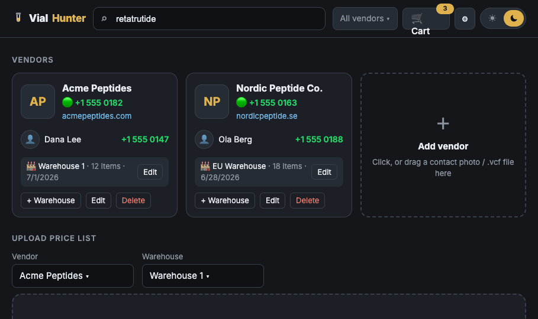
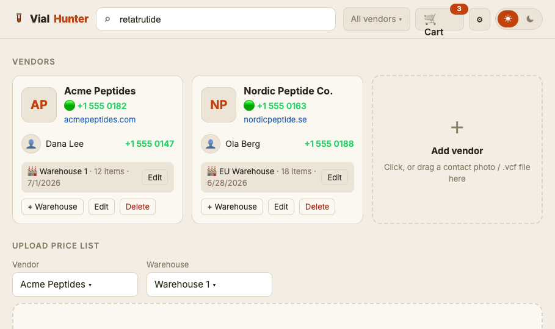

# Vial Hunter

Vendor-agnostic peptide price comparison. Pure static JAMstack app — one `index.html`, no build step, no server, no auth. All data lives in your browser's localStorage; use **Export/Import** for backups or moving between machines.

# [https://spuder.github.io/vialhunter/](https://spuder.github.io/vialhunter/)

**Dark — Graphite & Gold**

**Light — Warm Paper**

## Features

- **Vendors**: add/remove freely (nothing hard-coded). Drag a contact photo or `.vcf` card onto a vendor. Company + employee WhatsApp numbers render as clickable `wa.me` links.
- **Warehouses**: one vendor → many warehouses, each with its own price list, shipping cost, free-shipping threshold, and minimum order.
- **Price list upload**: drag & drop CSV or Excel (parsed locally, understands the "P Test" sheet layout with Shipping/Minimum/Upload Date meta rows). PDF extraction uses the Claude API — paste your API key in ⚙ Settings (key stays in your browser, calls go straight to api.anthropic.com).
- **Search**: type a peptide; every warehouse stocking it appears, lowest price flagged BEST.
- **Cart optimizer**: finds the cheapest purchase plan, splitting across warehouses while accounting for shipping, free-ship thresholds, and minimum orders. Also shows "buy everything from one vendor" totals. Generates a WhatsApp order message per vendor with a one-click Copy + Open WhatsApp button.

## CSV format

Header row with `Code, Name, Specification, Price` columns (order/extra columns fine). Optional meta rows above it: `Shipping Cost`, `Minimum Order`, `Upload Date`. See `sample-pricelist.csv`. Files without headers are parsed by column position. Everything lands in an editable review table before saving.

## Notes

- API key is never included in Export backups.
- Data is per-browser. To share a dataset with someone, send them your Export JSON.
- Sample vendor/contact numbers in the demo use the reserved `555 01xx` fictional range — they are placeholders, not real WhatsApp lines.
