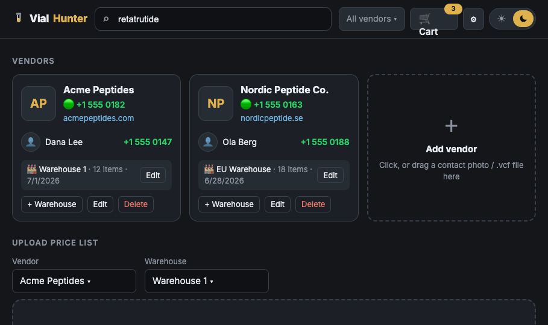
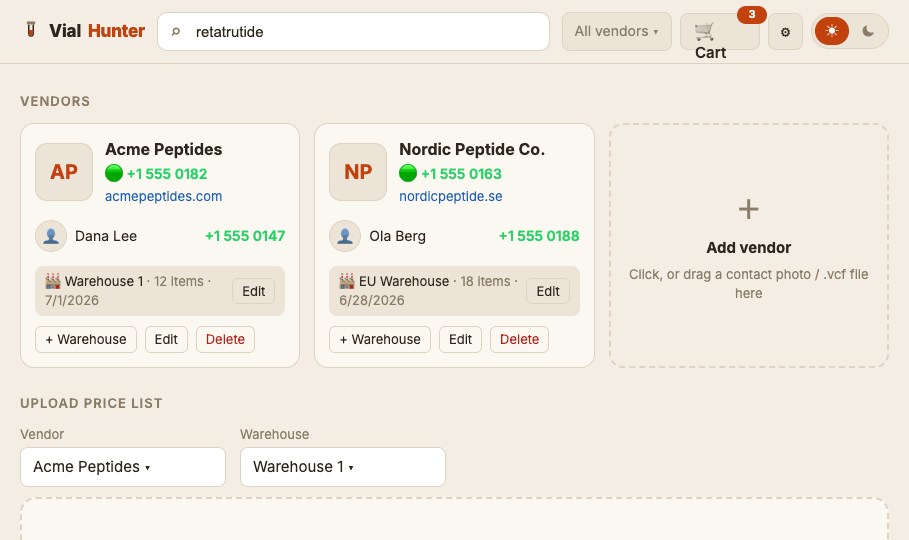
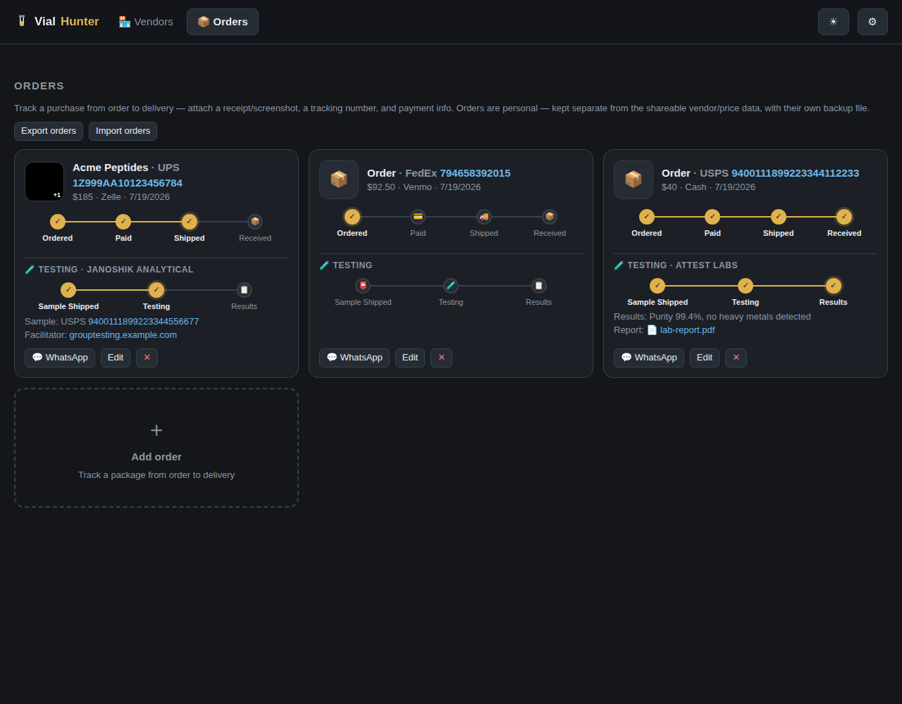

# Vial Hunter

Vendor-agnostic peptide price comparison. Pure static JAMstack app — one `index.html`, no build step, no server, no auth. All data lives in your browser's localStorage; use **Export/Import** for backups, or pair your own **Supabase** project in ⚙ Settings to sync across devices.

# [https://spuder.github.io/vialhunter/](https://spuder.github.io/vialhunter/)

**Dark — Graphite & Gold**

**Light — Warm Paper**

**Orders — shipping & lab-testing progress**

## Features

- **Vendors**: add/remove freely (nothing hard-coded). Drag a contact photo or `.vcf` card onto a vendor. Company + employee WhatsApp numbers render as clickable `wa.me` links.
- **Warehouses**: one vendor → many warehouses, each with its own price list, shipping cost, free-shipping threshold, and minimum order.
- **Price list upload**: drag & drop CSV or Excel (parsed locally, understands the "P Test" sheet layout with Shipping/Minimum/Upload Date meta rows). PDF extraction uses the Claude API — paste your API key in ⚙ Settings (key stays in your browser, calls go straight to api.anthropic.com).
- **Search**: type a peptide; every warehouse stocking it appears, lowest price flagged BEST.
- **Cart optimizer**: finds the cheapest purchase plan, splitting across warehouses while accounting for shipping, free-ship thresholds, and minimum orders. Also shows "buy everything from one vendor" totals. Generates a WhatsApp order message per vendor with a one-click Copy + Open WhatsApp button.
- **Order tracking**: its own "📦 Orders" tab, separate from the shareable vendor/pricing view. Log a purchase with multiple receipt/screenshot photos, one or more COAs (Certificate of Analysis — PDF or image), carrier + tracking number (click-through to FedEx/UPS/USPS/DHL tracking), payment amount and method. Pick *which* vendor number was used for the order (company line or a specific employee) so the order's one-click WhatsApp button messages the right person. A left-to-right dot-and-line progress tracker (Ordered → Paid → Shipped → Received) is clickable both in the order form and on the card, and remembers the date each stage was reached. Orders are stored under their own localStorage key with their own Export/Import buttons, so they never end up in a vendor backup you share with someone else.
- **Lab testing**: a second, independent progress tracker underneath each order's shipping progress (Sample Shipped → Testing → Results — starts untouched until you mark the first step). Records the lab name, the sample's own carrier + tracking number, a group testing facilitator website, free-text results, and the lab report itself (PDF or image, multiple allowed) as downloadable files on the card.
- **Supabase sync (optional)**: pair your own free Supabase project in ⚙ Settings to sync vendors, cart, and orders across devices (e.g. a phone and a laptop). Fully optional and off by default — the app is still no-build/no-server/no-auth; supabase-js is only fetched from a CDN once you actually pair a project. In-app instructions (with the SQL to run) are in Settings under "Where do I get a Supabase URL and key?". If you pair a project that already has data on it (e.g. from another device), you're asked whether to keep the remote data or overwrite it with this device's; if you pair an empty project and already have local data, you're offered a one-way migration up. After that, changes debounce-push to Supabase a couple seconds after you stop editing, and a 💻/☁ icon next to the logo shows whether you're on local-only or synced storage.

## CSV format

Header row with `Code, Name, Specification, Price` columns (order/extra columns fine). Optional meta rows above it: `Shipping Cost`, `Minimum Order`, `Upload Date`. See `sample-pricelist.csv`. Files without headers are parsed by column position. Everything lands in an editable review table before saving.

## Notes

- API key is never included in Export backups.
- Data is per-browser. To share a dataset with someone, send them your Export JSON — it contains vendors/warehouses/prices only, never your orders.
- Orders back up to their own JSON file via the "Export orders" / "Import orders" buttons on the Orders tab, since they're personal purchase history rather than shareable pricing data.
- Sample vendor/contact numbers in the demo use the reserved `555 01xx` fictional range — they are placeholders, not real WhatsApp lines.
- Your Supabase URL/anon key are treated like the Claude API key: stored only in this browser, never included in Export backups, and stripped from anything you Import. Anyone holding your Supabase URL + anon key can read/write that project's `vialhunter_sync` table, so keep them private and use a project dedicated to this app.
